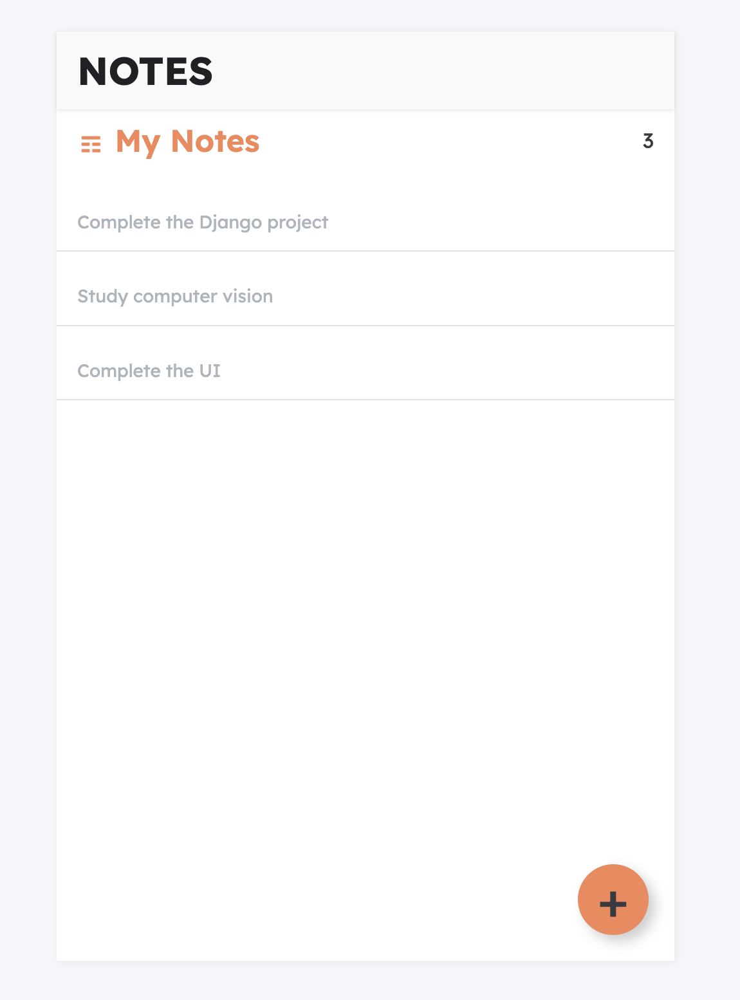
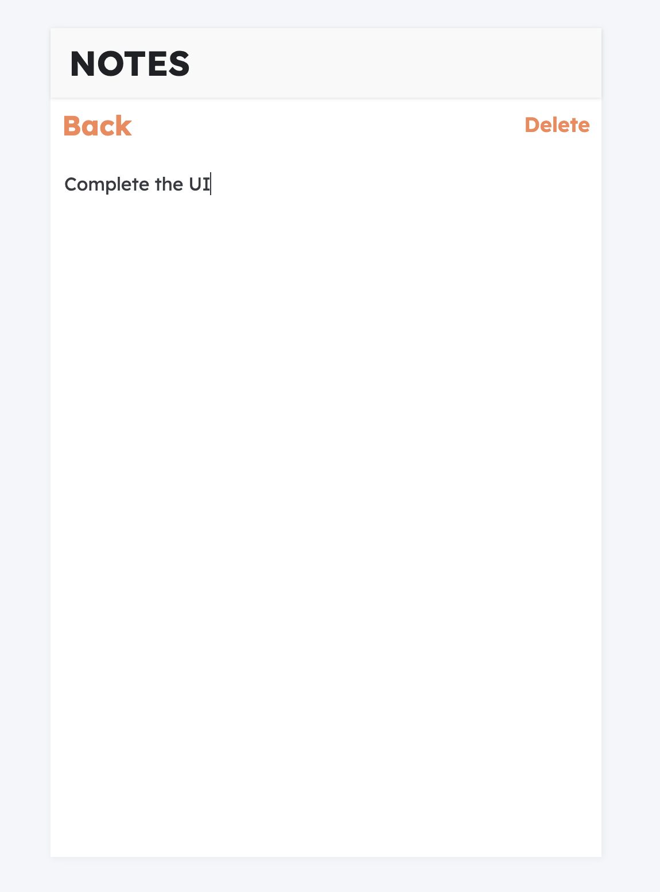

Install:
 json-server 
 reat-router-dom 

<h4>To run server: npm run server (main command added to package.json file)</h4>

- Saves automatically when clicked BACK button after edit the note
- Saves notes to local json database

